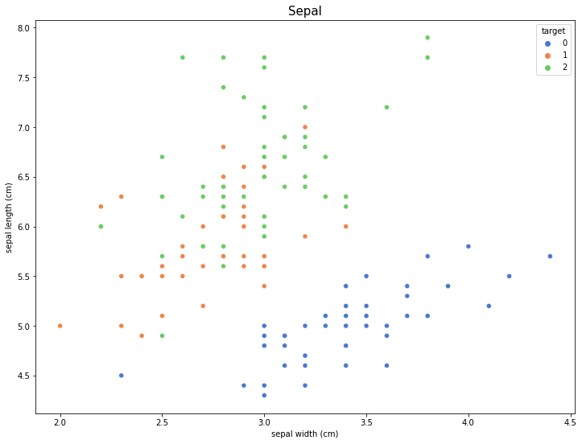
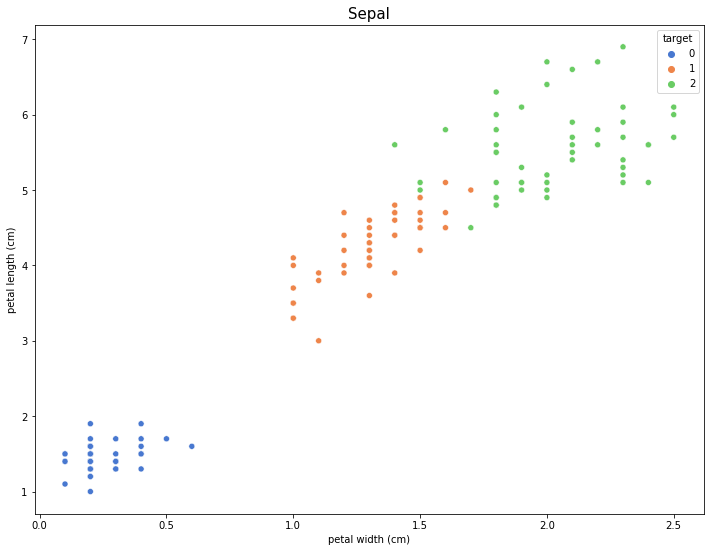
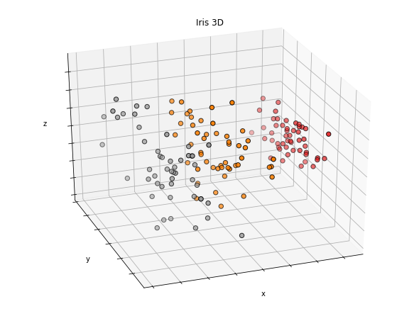

# Iris dataset 다루기 1

---

# Scikit-learn: 분류 - iris 데이터 로드(dataset 활용)

### 데이터 로드하기

- [iris 데이터세트](https://scikit-learn.org/stable/modules/generated/sklearn.datasets.load_iris.html#sklearn.datasets.load_iris)
- 붓꽃 분류

---

``` python
import warnings
import pandas as pd
from sklearn.datasets import load_iris

# 불필요한 경고 출력을 막아준다.
warnings.filterwarnings('ignore')

iris = load_iris()
iris
'''출력
dictionary 형태로 피쳐 데이터를 포함한 데이터 세트의 전반적인 내용들이 표시된다.
'''
```


### Iris dataset의 내용들

---

- DESCR : 데이터셋의 정보를 보여줌
- data : feature data
- feature_names : feature data의 컬럼 이름
- target : label data (수치형)
- target_names : label의 이름 (문자형)

---

``` python
data = iris['data']
data[:5]
'''출력
array([[5.1, 3.5, 1.4, 0.2],
       [4.9, 3. , 1.4, 0.2],
       [4.7, 3.2, 1.3, 0.2],
       [4.6, 3.1, 1.5, 0.2],
       [5. , 3.6, 1.4, 0.2]])
'''

feature_names = iris['feature_names']
feature_names
'''출력
['sepal length (cm)',
 'sepal width (cm)',
 'petal length (cm)',
 'petal width (cm)']
'''
```

---

- sepal : 꽃 받침
- petal : 꽃잎

---

``` python
target = iris['target']
target
'''출력
array([0, 0, 0, 0, 0, 0, 0, 0, 0, 0, 0, 0, 0, 0, 0, 0, 0, 0, 0, 0, 0, 0,
       0, 0, 0, 0, 0, 0, 0, 0, 0, 0, 0, 0, 0, 0, 0, 0, 0, 0, 0, 0, 0, 0,
       0, 0, 0, 0, 0, 0, 1, 1, 1, 1, 1, 1, 1, 1, 1, 1, 1, 1, 1, 1, 1, 1,
       1, 1, 1, 1, 1, 1, 1, 1, 1, 1, 1, 1, 1, 1, 1, 1, 1, 1, 1, 1, 1, 1,
       1, 1, 1, 1, 1, 1, 1, 1, 1, 1, 1, 1, 2, 2, 2, 2, 2, 2, 2, 2, 2, 2,
       2, 2, 2, 2, 2, 2, 2, 2, 2, 2, 2, 2, 2, 2, 2, 2, 2, 2, 2, 2, 2, 2,
       2, 2, 2, 2, 2, 2, 2, 2, 2, 2, 2, 2, 2, 2, 2, 2, 2, 2])
'''

iris['target_names']
'''출력
array(['setosa', 'versicolor', 'virginica'], dtype='<U10')
'''
```


---

### dataset으로부터 데이터프레임 만들기

---

``` python
df_iris = pd.DataFrame(data, columns=feature_names)
df_iris.head()
'''출력
 sepal length (cm)  sepal width (cm)  petal length (cm)  petal width (cm)
0             5.1               3.5                1.4               0.2
1             4.9               3.0                1.4               0.2
2             4.7               3.2                1.3               0.2
3             4.6               3.1                1.5               0.2
4             5.0               3.6                1.4               0.2
'''

df_iris['target'] = target
df_iris.head()
'''출력
 sepal length (cm)  sepal width (cm)  petal length (cm)  petal width (cm)  target
0             5.1               3.5                1.4               0.2       0
1             4.9               3.0                1.4               0.2       0
2             4.7               3.2                1.3               0.2       0
3             4.6               3.1                1.5               0.2       0
4             5.0               3.6                1.4               0.2       0
'''
```


---

### 시각화

---

``` python
import matplotlib.pyplot as plt
import seaborn as sns

plt.rcParams["figure.figsize"] = (12, 9)

sns.scatterplot('sepal width (cm)', 'sepal length (cm)', hue='target', palette='muted', data=df_iris)
plt.title('Sepal', fontsize=15)
plt.show()
```



``` python
sns.scatterplot('petal width (cm)', 'petal length (cm)', hue='target', palette='muted', data=df_iris)
plt.title('Sepal', fontsize=15)
plt.show()
```



``` python
from mpl_toolkits.mplot3d import Axes3D
from sklearn.decomposition import PCA

fig = plt.figure(figsize=(8, 6))
ax = Axes3D(fig, elev=-150, azim=110)

# PCA (차원축소) : 모두 4가지의 정보를 3차원의 공간에 표시하기 위해 1개의 차원을 제거함
X_reduced = PCA(n_components=3).fit_transform(df_iris.drop('target', 1))
ax.scatter(X_reduced[:, 0], X_reduced[:, 1], X_reduced[:, 2], c=df_iris['target'], cmap=plt.cm.Set1, edgecolor='k', s=40)
ax.set_title('Iris 3D')
ax.set_xlabel('x')
ax.w_xaxis.set_ticklabels([])
ax.set_ylabel('y')
ax.w_yaxis.set_ticklabels([])
ax.set_zlabel('z')
ax.w_zaxis.set_ticklabels([])

plt.show()
```


